<!-- ═══════════════════════════════════════════════════════════════════ -->
<!-- ██          GLACIER.OS DYNAMIC HERO SECTION                      ██ -->
<!-- ═══════════════════════════════════════════════════════════════════ -->

 

<!-- ══════════════ GLACIER LINK BADGES ══════════════ -->

&nbsp;
&nbsp;
&nbsp;
&nbsp;

  

&nbsp;

<!-- ═══════════════════════════════════════════════════════════════════ -->
<!-- ██               ANIMATED NEON DIVIDER                          ██ -->
<!-- ═══════════════════════════════════════════════════════════════════ -->

<!-- ═══════════════════════════════════════════════════════════════════ -->
<!-- ██              TECH STACK — FUTURISTIC GRID                    ██ -->
<!-- ═══════════════════════════════════════════════════════════════════ -->

<!-- ═══════════════════════════════════════════════════════════════════ -->
<!-- ██            CLOUD SERVICES — ARCHITECTURE MAP                 ██ -->
<!-- ═══════════════════════════════════════════════════════════════════ -->

<!-- ═══════════════════════════════════════════════════════════════════ -->
<!-- ██              PROJECTS — MISSION CONTROL DASHBOARD             ██ -->
<!-- ═══════════════════════════════════════════════════════════════════ -->

 
<h2 align="center">🚀 `> MISSION_CONTROL.projects()`</h2>
 

  

  

<!-- ═══════════════════════════════════════════════════════════════════ -->
<!-- ██              CERTIFICATIONS — VERIFIED CLEARANCES             ██ -->
<!-- ═══════════════════════════════════════════════════════════════════ -->

<!-- ═══════════════════════════════════════════════════════════════════ -->
<!-- ██                EDUCATION — TIMELINE PROTOCOL                 ██ -->
<!-- ═══════════════════════════════════════════════════════════════════ -->

<!-- ═══════════════════════════════════════════════════════════════════ -->
<!-- ██            COMMUNITY & PROFILES — NETWORK MAP                ██ -->
<!-- ═══════════════════════════════════════════════════════════════════ -->

 
<h2 align="center">🌐 `> NETWORK_MAP.scan()`</h2>
 

&nbsp;
&nbsp;

  

&nbsp;
&nbsp;

  

&nbsp;

<!-- ═══════════════════════════════════════════════════════════════════ -->
<!-- ██              GITHUB STATS — SYSTEM TELEMETRY                  ██ -->
<!-- ═══════════════════════════════════════════════════════════════════ -->

 
<h2 align="center">📊 `> SYSTEM_TELEMETRY.render()`</h2>
 

<!-- GitHub Stats -->

  

<!-- Top Languages -->

  

<!-- Activity Graph -->

  

<!-- Trophies -->

<!-- ═══════════════════════════════════════════════════════════════════ -->
<!-- ██                 CONTRIBUTION SNAKE                            ██ -->
<!-- ═══════════════════════════════════════════════════════════════════ -->

 
<h2 align="center">🐍 `> CONTRIBUTION_SNAKE.animate()`</h2>
 

<picture>
  <source media="(prefers-color-scheme: dark)" srcset="https://raw.githubusercontent.com/shubham-gayke/shubham-gayke/output/github-snake-dark.svg" />
  <source media="(prefers-color-scheme: light)" srcset="https://raw.githubusercontent.com/shubham-gayke/shubham-gayke/output/github-snake.svg" />
  
</picture>

<!-- ═══════════════════════════════════════════════════════════════════ -->
<!-- ██                    CONNECT — FOOTER                           ██ -->
<!-- ═══════════════════════════════════════════════════════════════════ -->

  

  

