<div align="center">

<!-- ═══════════════════════════════════════════════════════════════════ -->
<!-- ██          GLACIER.OS DYNAMIC HERO SECTION                      ██ -->
<!-- ═══════════════════════════════════════════════════════════════════ -->



<br/>

<!-- ══════════════ GLACIER LINK BADGES ══════════════ -->

<a href="https://shubham-gayke.github.io/Portfolio-/"></a>&nbsp;
<a href="https://www.linkedin.com/in/shubhamgayke/"></a>&nbsp;
<a href="https://drive.google.com/file/d/1sSvI-UPhe_FvE0ypRYgzPECl5ng3pbRe/view?usp=sharing"></a>&nbsp;
<a href="mailto:shubhamgayke9860@gmail.com"></a>&nbsp;
<a href="https://github.com/shubham-gayke"></a>

<br/><br/>


&nbsp;


</div>

<!-- ═══════════════════════════════════════════════════════════════════ -->
<!-- ██               ANIMATED NEON DIVIDER                          ██ -->
<!-- ═══════════════════════════════════════════════════════════════════ -->


<div align="center">

<!-- ══════════════ SYSTEM BOOT / ABOUT ══════════════ -->

##  &nbsp;`> SYSTEM INITIALIZATION`

</div>

```js
// ══════════════════════════════════════════════════════════════════
// ██  system.boot() — Loading Shubham Gayke's Neural Interface  ██
// ══════════════════════════════════════════════════════════════════

const DevOpsEngineer = {
    identity: {
        name:     "Shubham Gayke",
        role:     "DevOps Engineer | Cloud Architect | AI Automation Specialist",
        location: "India 🇮🇳",
        email:    "shubhamgayke9860@gmail.com",
        phone:    "+91 9168469745",
    },

    education: {
        degree:       "B-Tech in Computer Science Engineering",
        university:   "Dr. Babasaheb Ambedkar Technological University",
        cgpa:         "8.12 / 10",
        achievement:  "🥇 1st Rank in Polytechnic — Diploma (92.17%)",
    },

    currentMission: [
        "🔥 Building scalable, secure & production-ready cloud systems",
        "🤖 Developing AI agents with MCP (Model Context Protocol) integration",
        "⚡ Automating everything — if it runs twice, it gets a pipeline",
        "🧠 Pushing boundaries of AI-powered developer tooling",
    ],

    philosophy: "Infrastructure should be invisible, resilient, and self-healing.",
    
    deploy: function() {
        return "🚀 Systems online. All pipelines green. Zero downtime achieved.";
    }
};

DevOpsEngineer.deploy();
// Output: 🚀 Systems online. All pipelines green. Zero downtime achieved.
```


<!-- ═══════════════════════════════════════════════════════════════════ -->
<!-- ██              TECH STACK — FUTURISTIC GRID                    ██ -->
<!-- ═══════════════════════════════════════════════════════════════════ -->

<div align="center">

##  &nbsp;`> TECH_ARSENAL.load()`

<br/>

<!-- ═══════ CLOUD PLATFORMS — HOLOGRAPHIC CARD ═══════ -->

<table>
<tr><td colspan="3" align="center">

### ☁️ `CLOUD_PLATFORMS && INFRASTRUCTURE`
  
</td></tr>
<tr>
<td align="center">

<br/><sub><b>AWS</b></sub>
</td>
<td align="center">

<br/><sub><b>Azure</b></sub>
</td>
<td align="center">

<br/><sub><b>Google Cloud</b></sub>
</td>
</tr>
<tr>
<td align="center">

<br/><sub><b>Terraform</b></sub>
</td>
<td align="center">

<br/><sub><b>Ansible</b></sub>
</td>
<td align="center">

<br/><sub><b>CloudFormation</b></sub>
</td>
</tr>
</table>

<!-- ═══════ CONTAINERS & ORCHESTRATION ═══════ -->

<table>
<tr><td colspan="4" align="center">

### 🐳 `CONTAINERS && ORCHESTRATION`
  
</td></tr>
<tr>
<td align="center">

<br/><sub><b>Docker</b></sub>
</td>
<td align="center">

<br/><sub><b>Kubernetes</b></sub>
</td>
<td align="center">

<br/><sub><b>Podman</b></sub>
</td>
<td align="center">

<br/><sub><b>Helm</b></sub>
</td>
</tr>
</table>

<!-- ═══════ CI/CD & DEVOPS PIPELINE ═══════ -->

<table>
<tr><td colspan="6" align="center">

### 🔄 `CI_CD && DEPLOYMENT_STRATEGIES`
  
</td></tr>
<tr>
<td align="center">

<br/><sub><b>Git</b></sub>
</td>
<td align="center">

<br/><sub><b>GitHub</b></sub>
</td>
<td align="center">

<br/><sub><b>GitLab</b></sub>
</td>
<td align="center">

<br/><sub><b>Jenkins</b></sub>
</td>
<td align="center">

<br/><sub><b>GH Actions</b></sub>
</td>
<td align="center">

<br/><sub><b>ArgoCD</b></sub>
</td>
</tr>
<tr><td colspan="6" align="center">

`Blue-Green` · `Canary` · `Rolling Update` · `Zero Downtime` · `GitOps`

</td></tr>
</table>

<!-- ═══════ PROGRAMMING & MONITORING ═══════ -->

<table>
<tr><td colspan="6" align="center">

### 💻 `PROGRAMMING && MONITORING`
  
</td></tr>
<tr>
<td align="center">

<br/><sub><b>Python</b></sub>
</td>
<td align="center">

<br/><sub><b>Bash</b></sub>
</td>
<td align="center">

<br/><sub><b>JavaScript</b></sub>
</td>
<td align="center">

<br/><sub><b>Prometheus</b></sub>
</td>
<td align="center">

<br/><sub><b>Grafana</b></sub>
</td>
<td align="center">

<br/><sub><b>SonarQube</b></sub>
</td>
</tr>
</table>

<!-- ═══════ WEB SERVERS & MESSAGING ═══════ -->

<table>
<tr><td colspan="5" align="center">

### 🌐 `WEB_SERVERS && PROXIES`
  
</td></tr>
<tr>
<td align="center">

<br/><sub><b>NGINX</b></sub>
</td>
<td align="center">

<br/><sub><b>Apache</b></sub>
</td>
<td align="center">

<br/><sub><b>HAProxy</b></sub>
</td>
<td align="center">

<br/><sub><b>API Gateway</b></sub>
</td>
<td align="center">

<br/><sub><b>Load Balancer</b></sub>
</td>
</tr>
</table>

<table>
<tr><td colspan="5" align="center">

### 📨 `MESSAGING && EVENT_STREAMING`
  
</td></tr>
<tr>
<td align="center">

<br/><sub><b>Kafka</b></sub>
</td>
<td align="center">

<br/><sub><b>RabbitMQ</b></sub>
</td>
<td align="center">

<br/><sub><b>Amazon SQS</b></sub>
</td>
<td align="center">

<br/><sub><b>Amazon SNS</b></sub>
</td>
<td align="center">

<br/><sub><b>ActiveMQ</b></sub>
</td>
</tr>
</table>

<!-- ═══════ ARCHITECTURE & SCALING ═══════ -->

<table>
<tr><td colspan="5" align="center">

### 🏗️ `ARCHITECTURE && SCALING`
  
</td></tr>
<tr>
<td align="center">

<br/><sub><b>Microservices</b></sub>
</td>
<td align="center">

<br/><sub><b>Redis</b></sub>
</td>
<td align="center">

<br/><sub><b>CDN</b></sub>
</td>
<td align="center">

<br/><sub><b>Service Discovery</b></sub>
</td>
<td align="center">

<br/><sub><b>Auto Scaling</b></sub>
</td>
</tr>
</table>

<!-- ═══════ NETWORKING & SECURITY ═══════ -->

<table>
<tr><td colspan="6" align="center">

### 🔒 `NETWORKING && SECURITY`
  
</td></tr>
<tr>
<td align="center">

<br/><sub><b>SSL/TLS</b></sub>
</td>
<td align="center">

<br/><sub><b>TCP/IP & UDP</b></sub>
</td>
<td align="center">

<br/><sub><b>Firewall</b></sub>
</td>
<td align="center">

<br/><sub><b>NAT & VPN</b></sub>
</td>
<td align="center">

<br/><sub><b>RBAC</b></sub>
</td>
<td align="center">

<br/><sub><b>DNS</b></sub>
</td>
</tr>
</table>

<!-- ═══════ AI & AUTOMATION ═══════ -->

<table>
<tr><td colspan="5" align="center">

### 🤖 `AI && AUTOMATION_ENGINE`
  
</td></tr>
<tr>
<td align="center">

<br/><sub><b>LangChain</b></sub>
</td>
<td align="center">

<br/><sub><b>n8n</b></sub>
</td>
<td align="center">

<br/><sub><b>GitHub Copilot</b></sub>
</td>
<td align="center">

<br/><sub><b>Claude AI</b></sub>
</td>
<td align="center">

<br/><sub><b>AI Agents</b></sub>
</td>
</tr>
<tr><td colspan="5" align="center">

`MCP Servers` · `Prompt Engineering` · `Multi-Agent Systems` · `Vector Search` · `Workflow Automation`

</td></tr>
</table>

</div>


<!-- ═══════════════════════════════════════════════════════════════════ -->
<!-- ██            CLOUD SERVICES — FUTURISTIC DASHBOARD             ██ -->
<!-- ═══════════════════════════════════════════════════════════════════ -->

<div align="center">

## ☁️ `> CLOUD_SERVICES.map()`

<br/>

</div>

```
┌─────────────────────────────────────────────────────────────────────────────────┐
│                                                                                 │
│   ██████╗ ██╗      ██████╗ ██╗   ██╗██████╗                                    │
│  ██╔════╝ ██║     ██╔═══██╗██║   ██║██╔══██╗                                   │
│  ██║      ██║     ██║   ██║██║   ██║██║  ██║                                   │
│  ██║      ██║     ██║   ██║██║   ██║██║  ██║                                   │
│  ╚██████╗ ███████╗╚██████╔╝╚██████╔╝██████╔╝                                   │
│   ╚═════╝ ╚══════╝ ╚═════╝  ╚═════╝ ╚═════╝   ARCHITECTURE MAP                │
│                                                                                 │
│  ┌─────────────────────────┐  ┌──────────────────┐  ┌──────────────────┐       │
│  │  ☁️ AWS (27 Services)    │  │  ☁️ AZURE (9)     │  │  ☁️ GCP (9)      │       │
│  │                         │  │                  │  │                  │       │
│  │  EC2 ─── S3 ─── RDS    │  │  VMs ─── Blob    │  │  CE ──── GCS     │       │
│  │   │       │       │     │  │   │        │     │  │   │       │      │       │
│  │  Lambda  VPC    IAM     │  │  Functions VNet  │  │  CF ──── VPC     │       │
│  │   │       │       │     │  │   │        │     │  │   │       │      │       │
│  │  EKS    ECS  CloudForm  │  │  AKS    Entra   │  │  GKE    IAM     │       │
│  │   │       │       │     │  │   │        │     │  │   │       │      │       │
│  │  CWatch  SNS    SQS    │  │  ARM    Monitor  │  │  Deploy  Ops    │       │
│  │   │       │       │     │  │  Templates       │  │  Manager         │       │
│  │  DynamoDB Route53 CF    │  └──────────────────┘  └──────────────────┘       │
│  │   │       │       │     │                                                    │
│  │  API_GW  EBS  Secrets   │   ┌──────────────────────────────────────────┐     │
│  │   │       │       │     │   │  🔗 EXTENDED AWS SERVICES                │     │
│  │  Athena  Glue Redshift  │   │                                          │     │
│  │   │       │       │     │   │  SageMaker ─── EMR ─── Cognito           │     │
│  │  Kinesis WAF  StepFn    │   │  Step Functions ─ Kinesis ─ WAF          │     │
│  │                         │   │  Elastic Beanstalk ─── Secrets Manager   │     │
│  └─────────────────────────┘   └──────────────────────────────────────────┘     │
│                                                                                 │
└─────────────────────────────────────────────────────────────────────────────────┘
```


<!-- ═══════════════════════════════════════════════════════════════════ -->
<!-- ██              PROJECTS — MISSION CONTROL DASHBOARD             ██ -->
<!-- ═══════════════════════════════════════════════════════════════════ -->

<div align="center">

## 🚀 `> MISSION_CONTROL.projects()`

<br/>

</div>

```
┌──────────────────────────────────────────────────────────────────────────────┐
│ ⚡ MISSION CONTROL — ACTIVE DEPLOYMENTS                         [■][□][×]  │
├──────────────────────────────────────────────────────────────────────────────┤
│                                                                              │
│  ┌─── PROJECT ALPHA ───────────────────────────────────────────────────┐    │
│  │                                                                     │    │
│  │  🔥 Automated CI/CD Pipeline & Multi-Cloud Deployment               │    │
│  │  ─────────────────────────────────────────────────────────          │    │
│  │  Designed and implemented a fully automated CI/CD pipeline          │    │
│  │  using GitHub Actions, Jenkins, and Docker to deploy                │    │
│  │  microservices across AWS and Azure.                                │    │
│  │                                                                     │    │
│  │  ✅ RESULT: Reduced deployment time by 40%                          │    │
│  │                                                                     │    │
│  │  STACK: [GitHub Actions] [Jenkins] [Docker] [AWS] [Azure] [Bash]   │    │
│  │  STATUS: ████████████████████████████████████████ 100% DEPLOYED     │    │
│  └─────────────────────────────────────────────────────────────────────┘    │
│                                                                              │
│  ┌─── PROJECT BETA ────────────────────────────────────────────────────┐    │
│  │                                                                     │    │
│  │  ⚙️  Infrastructure as Code Automation & GitOps                     │    │
│  │  ─────────────────────────────────────────────────────────          │    │
│  │  Built scalable cloud infrastructure using Terraform and            │    │
│  │  Ansible. Implemented GitOps workflow for Kubernetes                 │    │
│  │  deployments with automated rollbacks.                              │    │
│  │                                                                     │    │
│  │  ✅ RESULT: Environment consistency & auto rollbacks                │    │
│  │                                                                     │    │
│  │  STACK: [Terraform] [Ansible] [Kubernetes] [GitOps] [Python]       │    │
│  │  STATUS: ████████████████████████████████████████ 100% DEPLOYED     │    │
│  └─────────────────────────────────────────────────────────────────────┘    │
│                                                                              │
│  ┌─── PROJECT GAMMA ───────────────────────────────────────────────────┐    │
│  │                                                                     │    │
│  │  📊 Kubernetes Cluster Monitoring & Logging                         │    │
│  │  ─────────────────────────────────────────────────────────          │    │
│  │  Deployed centralized monitoring and logging stack with             │    │
│  │  Prometheus, Grafana, and ELK stack. Custom alerts for              │    │
│  │  resource utilization reducing system downtime.                     │    │
│  │                                                                     │    │
│  │  ✅ RESULT: Significant reduction in system downtime                │    │
│  │                                                                     │    │
│  │  STACK: [Prometheus] [Grafana] [ELK] [Kubernetes] [NGINX] [RBAC]  │    │
│  │  STATUS: ████████████████████████████████████████ 100% DEPLOYED     │    │
│  └─────────────────────────────────────────────────────────────────────┘    │
│                                                                              │
│  ALL SYSTEMS NOMINAL ✅   UPTIME: 99.9%   PIPELINES: GREEN                  │
└──────────────────────────────────────────────────────────────────────────────┘
```


<!-- ═══════════════════════════════════════════════════════════════════ -->
<!-- ██              CERTIFICATIONS — VERIFIED CLEARANCES             ██ -->
<!-- ═══════════════════════════════════════════════════════════════════ -->

<div align="center">

## 🎖️ `> SECURITY_CLEARANCE.verify()`

<br/>

<!-- Certification Badges with Glow -->

| `STATUS` | `CERTIFICATION` | `ISSUER` | `VERIFY` |
|:---:|:---|:---|:---:|
|  | **Oracle Certified DevOps Professional** | Oracle | [](https://catalog-education.oracle.com/ords/certview/sharebadge?id=D5959B79548455792A7547789EC433509523A61DAE0BFF0B1CF42B6437F7CD44) |
|  | **Oracle AWS Certified Architect Professional** | Oracle | [](https://catalog-education.oracle.com/ords/certview/sharebadge?id=350B59B6807EFD465DC623FECE329C9CFE51A56BA1266899394D6DA5E5CFDC02) |
|  | **SQL Advanced** | HackerRank | [](https://www.hackerrank.com/certificates/iframe/3877fd359065) |
|  | **REST API Certification** | HackerRank | [](https://www.hackerrank.com/certificates/iframe/e7ecdbe31b88) |
|  | **Microsoft AI Skills Fest 2026** | Microsoft / Credly | [](https://www.credly.com/badges/f9cfab76-4566-4a2f-8241-4bba8207ed6a) |
|  | **Azure Certification & Achievement** | Microsoft | [](https://learn.microsoft.com/en-us/users/shubhamgayke-0899/) |
|  | **GCP Skills & Badges** | Google Cloud / Credly | [](https://www.credly.com/users/shubham-gayke/edit/badges/credly) |
|  | **AWS Solution Architect** | Udemy | [](https://www.udemy.com/certificate/UC-3cee2428-890d-44c1-b27d-b07c3d319046/) |
|  | **Deloitte Completion Certificate** | Forage | [](https://www.theforage.com/completion-certificates/9PBTqmSxAf6zZTseP/udmxiyHeqYQLkTPvf_9PBTqmSxAf6zZTseP_QHZfHBduwup8Bnq62_1755798824468_completion_certificate.pdf) |

</div>


<!-- ═══════════════════════════════════════════════════════════════════ -->
<!-- ██                EDUCATION — TIMELINE PROTOCOL                 ██ -->
<!-- ═══════════════════════════════════════════════════════════════════ -->

<div align="center">

## 🎓 `> TRAINING_PROTOCOL.timeline()`

<br/>

</div>

```
╔══════════════════════════════════════════════════════════════════════╗
║                    EDUCATION TIMELINE PROTOCOL                       ║
╠══════════════════════════════════════════════════════════════════════╣
║                                                                      ║
║   ◉━━━━━━━━━━━━━━━━━━━━━━━━━━━━━━━━━━━━━━━━━━━━━━━━━━━━━━━━━━━━◉  ║
║   ┃                                                              ┃  ║
║   ┃   🎓  B-TECH IN COMPUTER SCIENCE ENGINEERING                 ┃  ║
║   ┃   ├── Dr. Babasaheb Ambedkar Technological University       ┃  ║
║   ┃   └── CGPA: ████████░░ 8.12/10                              ┃  ║
║   ┃                                                              ┃  ║
║   ┃   🏅  DIPLOMA IN COMPUTER ENGINEERING                        ┃  ║
║   ┃   ├── MSBTE                                                  ┃  ║
║   ┃   ├── Score: █████████▒ 92.17%                               ┃  ║
║   ┃   └── 🥇 ★ 1ST RANK IN POLYTECHNIC ★                       ┃  ║
║   ┃                                                              ┃  ║
║   ┃   📜  SECONDARY SCHOOL CERTIFICATE (SSC)                    ┃  ║
║   ┃   ├── Maharashtra State Board                                ┃  ║
║   ┃   └── Score: ████████▒░ 86.40%                               ┃  ║
║   ┃                                                              ┃  ║
║   ◉━━━━━━━━━━━━━━━━━━━━━━━━━━━━━━━━━━━━━━━━━━━━━━━━━━━━━━━━━━━━◉  ║
║                                                                      ║
╚══════════════════════════════════════════════════════════════════════╝
```


<!-- ═══════════════════════════════════════════════════════════════════ -->
<!-- ██            COMMUNITY & PROFILES — NETWORK MAP                ██ -->
<!-- ═══════════════════════════════════════════════════════════════════ -->

<div align="center">

## 🌐 `> NETWORK_MAP.scan()`

<br/>

<!-- Coding & Community Profiles -->

<a href="https://leetcode.com/u/Shubham_Gayke/"></a>&nbsp;
<a href="https://www.hackerrank.com/profile/shubhamgayke9860"></a>&nbsp;
<a href="https://github.com/shubham-gayke"></a>

<br/>

<a href="https://www.credly.com/users/shubham-gayke/badges/credly"></a>&nbsp;
<a href="https://learn.microsoft.com/en-us/users/shubhamgayke-0899/"></a>&nbsp;
<a href="https://dev.to/shubham_gayke"></a>

<br/><br/>

<a href="https://drive.google.com/file/d/1OzzT5Mz3NrrzNX2J7AIz2WrCvPAfnGu0/view?usp=sharing"></a>&nbsp;
<a href="https://community.oracle.com/ou/profile/discussions/Shubham%20Gayke"></a>

</div>


<!-- ═══════════════════════════════════════════════════════════════════ -->
<!-- ██              GITHUB STATS — SYSTEM TELEMETRY                  ██ -->
<!-- ═══════════════════════════════════════════════════════════════════ -->

<div align="center">

## 📊 `> SYSTEM_TELEMETRY.render()`

<br/>

<!-- GitHub Stats -->


<br/><br/>

<!-- Top Languages -->


<br/><br/>

<!-- Activity Graph -->


<br/><br/>

<!-- Trophies -->


</div>


<!-- ═══════════════════════════════════════════════════════════════════ -->
<!-- ██                 CONTRIBUTION SNAKE                            ██ -->
<!-- ═══════════════════════════════════════════════════════════════════ -->

<div align="center">

## 🐍 `> CONTRIBUTION_SNAKE.animate()`

<picture>
  <source media="(prefers-color-scheme: dark)" srcset="https://raw.githubusercontent.com/shubham-gayke/shubham-gayke/output/github-snake-dark.svg" />
  <source media="(prefers-color-scheme: light)" srcset="https://raw.githubusercontent.com/shubham-gayke/shubham-gayke/output/github-snake.svg" />
  
</picture>

</div>


<!-- ═══════════════════════════════════════════════════════════════════ -->
<!-- ██                    CONNECT — FOOTER                           ██ -->
<!-- ═══════════════════════════════════════════════════════════════════ -->

<div align="center">

## ⚡ `> ESTABLISH_CONNECTION()`

<br/>

```
 ╔═══════════════════════════════════════════════════════════════════════╗
 ║                                                                       ║
 ║   ┌─────────────────────────────────────────────────────────────┐     ║
 ║   │                                                             │     ║
 ║   │   📧  shubhamgayke9860@gmail.com                            │     ║
 ║   │   📱  +91 9168469745                                        │     ║
 ║   │   🔗  linkedin.com/in/shubhamgayke                          │     ║
 ║   │   💻  github.com/shubham-gayke                               │     ║
 ║   │   🌐  shubham-gayke.github.io/Portfolio-/                    │     ║
 ║   │                                                             │     ║
 ║   └─────────────────────────────────────────────────────────────┘     ║
 ║                                                                       ║
 ║   "Infrastructure should be invisible, resilient, and self-healing."  ║
 ║                                                          — Shubham    ║
 ║                                                                       ║
 ╚═══════════════════════════════════════════════════════════════════════╝
```

<br/>

<a href="mailto:shubhamgayke9860@gmail.com"></a>&nbsp;
<a href="https://www.linkedin.com/in/shubhamgayke/"></a>&nbsp;
<a href="https://drive.google.com/file/d/1sSvI-UPhe_FvE0ypRYgzPECl5ng3pbRe/view?usp=sharing"></a>&nbsp;
<a href="https://shubham-gayke.github.io/Portfolio-/"></a>

<br/><br/>


<br/><br/>

```
┌─────────────────────────────────────────────────────────────────┐
│                                                                 │
│   > session.end()                                               │
│   > Thank you for visiting my profile.                          │
│   > All systems operational. ████████████████████ 100%          │
│   > Connection terminated gracefully.                           │
│   > Until next time... ⚡                                       │
│                                                                 │
│   ⭐ Star my repos if you found them useful!                    │
│                                                                 │
└─────────────────────────────────────────────────────────────────┘
```

<br/>


</div>
